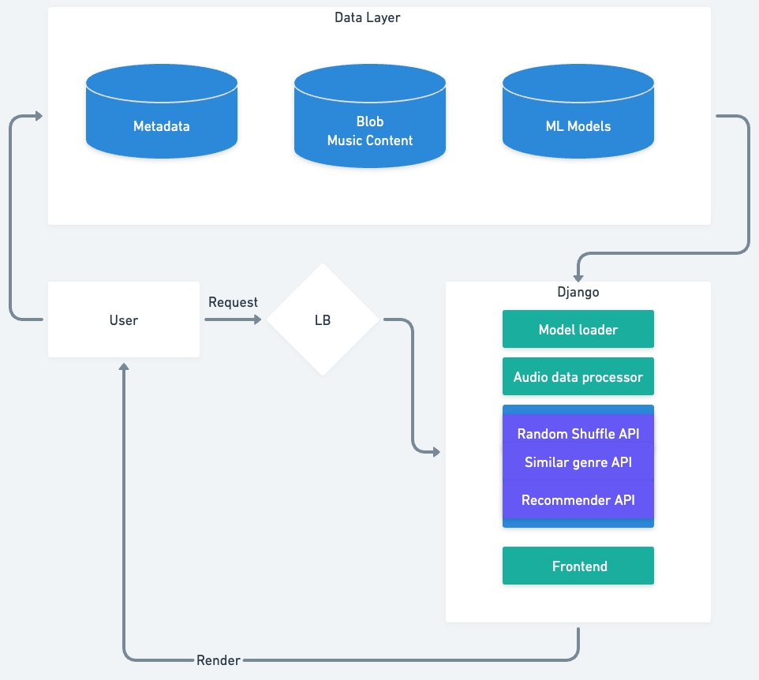
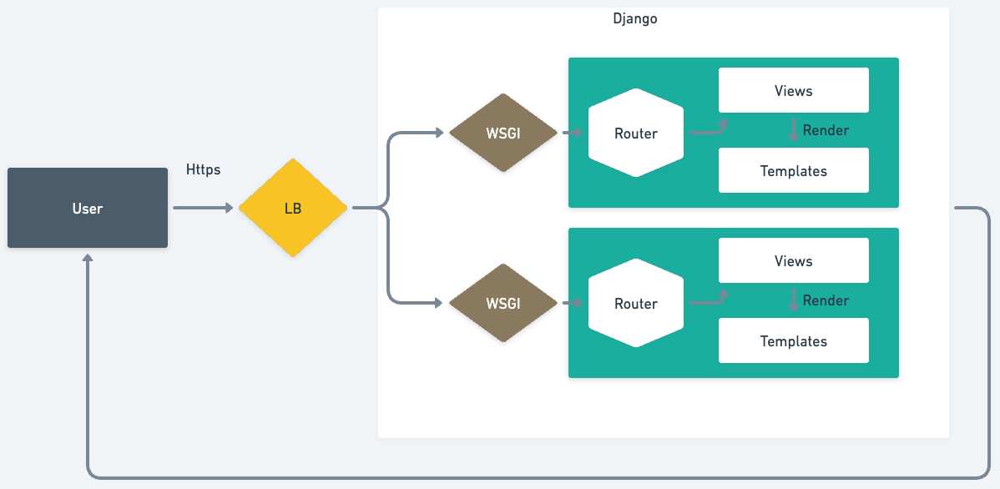

## Music recommendation app based on DL

## Overview
This project aims to serve as a full-cycle web application that enable users to discover music based on users preference. A deep learning model is trained to capture the digital features of the music input, and outputs a list of tracks with similar digital representation. Recommender system that suggests artists and music is constructed with collaborative filtering and alternating least squares methods. 





## This repository contains:
- ./ model: scripts train and test datasets for [GTZAN](https://www.kaggle.com/datasets/andradaolteanu/gtzan-dataset-music-genre-classification)

Here is the workflow of the training process. The raw data needs to be preprocess with the same sample rate and sample number. Then it is converted to spectrum representation using mel transformation or mfcc. The CNN model here is a simple AlexNet serves to capture the essence of the input data. 

- ./collaborative_filtering: recommendation system with collaborative filtering and alternating least squares. 
- ./templates: ON GOING, this will be encapsulated with other components into Django framework



## How to train
download the dataset as well as the annocation files and unzip them into './model/input/'
to install dependencies

'''
pip install -r requirements.txt
'''

to start training:
```
cd music-recommendation
python model/train.py
```